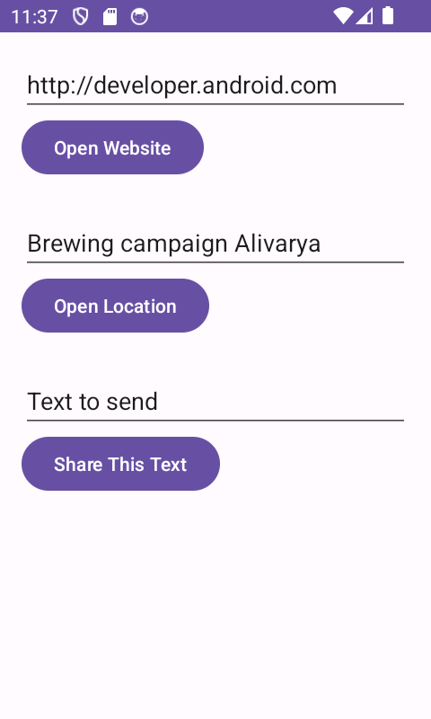
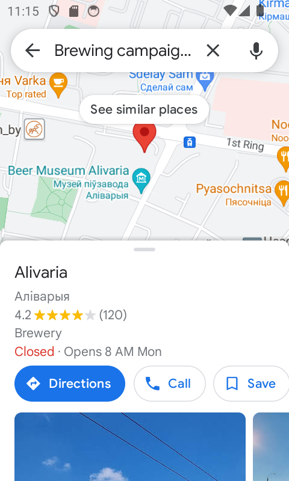
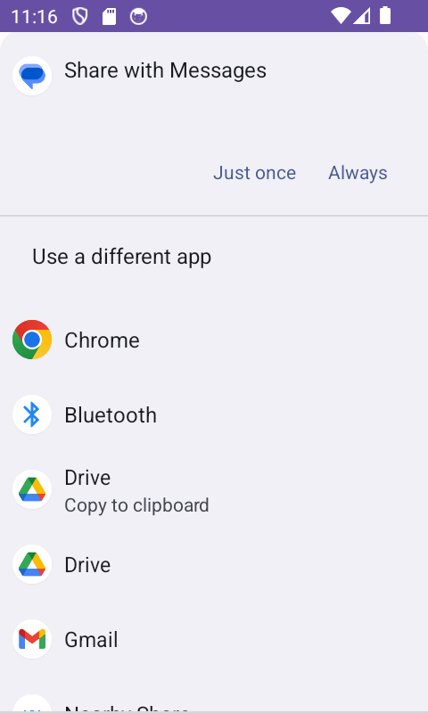
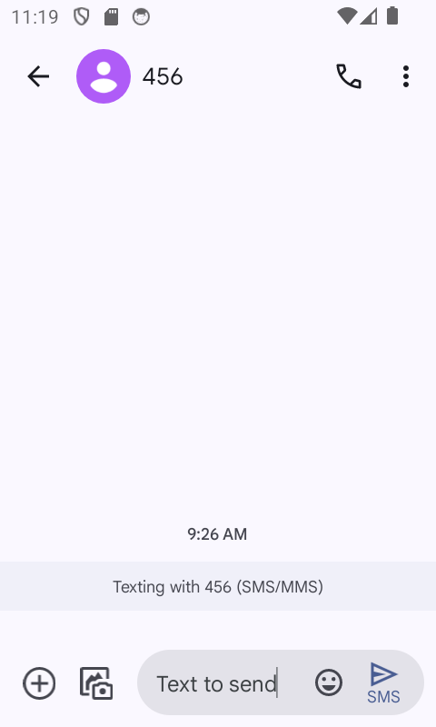

# Implicit Intents
## It's an app with one Activity and three options for actions: open a web site, open a location on a map, and share a snippet of text. All of the text fields are editable (EditText), but contain default values.

**The main screen** 

**Link opened with the Implicit Intents Receiver app**

**Link opened with the Google Chrome**

**Launched the map with the location in the EditText above the Button.**

**Launch a dialog with choices for sharing the text.**

